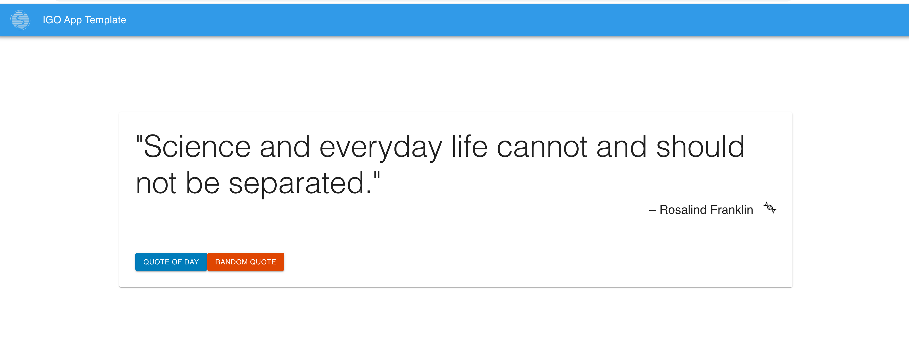

# IGO Data Team App Template



## Description
This is a barebones project exhibiting IGO Data Team's core stack - react, node, & mongo.

Features Include:
* MSKCC/IGO design resources
* Axios Service Calls & Caching
* IGO Design resources and linting standards (taken from [igo-dot-files](https://github.com/mskcc/igo-data-dotfiles))
* CAS Authentication Setup
* Deployment/Build scripts in README files

Please use this as a template, but modify and engineer as you see fit. Pull requests welcome!

## Dependencies
- mongo

## QuickStart
### I) Frontend
```
$ cd ./template-frontend && npm install && npm run start
```
### II) Mongo
```
$ mongod
```
### III) Backend
```
$ cd ./template-backend && npm install && npm run dev
```

## Please Read Before Deploying
Prior to deploying the application, please modify this template in a few sections so that they are relevant to your app.
### Makefile
Specify `[HOST]` to deploy to
```
deploy:
	cd ./template-frontend && npm run build && cd - \
	cd ./template-backend && npm run clean && cd - \
	rsync template-backend [HOST]:deployments/app-template
```

### template-frontend
./public/index.html
```
<meta
  name="description"
  content="Frontend App Template"
/>
```

./package.json
```
"name": "app-name",
```

./manifest.json
```
  "short_name": "Template Frontend",
  "name": "Template Frontend",
```

### template-backend
./bin/www
```
var debug = require("debug")("app-template:server");
```
./.env
```
mongoDB: app-template
```

./app.js
```
// REMOVE ME - populateDB
const {populateDB} = require('./models/setup_deleteMe');
populateDB();
```

package.json
```
"name": "template-backend",
```

./models/setup_deleteMe.js

`DELETE`

./helpers/constants
```
exports.constants = {
    logger: "app-template"
};
```

./helpers/winston
```
label({label: "App-Template"}),	// Added to log lines, e.g. { ..., "label":"App-Template"}
```

## Requested Features
* Backend Tests
```
$ pwd
/app-template/template-backend

$ npm run test

> template-backend@1.0.0 test /Users/streidd/work/app-template/template-backend
> ENV=test JWT_SECRET={ADD_JWT_SECRET} nyc _mocha --timeout 10000 --exit --report lcovonly -- -R spec

Error: No test files found: "test"
----------|----------|----------|----------|----------|-------------------|
File      |  % Stmts | % Branch |  % Funcs |  % Lines | Uncovered Line #s |
----------|----------|----------|----------|----------|-------------------|
All files |        0 |        0 |        0 |        0 |                   |
----------|----------|----------|----------|----------|-------------------|
npm ERR! code ELIFECYCLE
npm ERR! errno 1
npm ERR! template-backend@1.0.0 test: `ENV=test JWT_SECRET={ADD_JWT_SECRET} nyc _mocha --timeout 10000 --exit --report lcovonly -- -R spec`
npm ERR! Exit status 1
npm ERR! 
npm ERR! Failed at the template-backend@1.0.0 test script.
npm ERR! This is probably not a problem with npm. There is likely additional logging output above.

npm ERR! A complete log of this run can be found in:
npm ERR!     /Users/streidd/.npm/_logs/2020-06-19T18_58_28_098Z-debug.log 
```
